## Objetivo

Aqui vai o objetivo macro do roteiro. Por que estamos fazendo o que estamos fazendo?

## Infra

Os pontos "tarefas" são os passos que devem ser seguidos para a realização do roteiro. Eles devem ser claros e objetivos. Com evidências claras de que foram realizados.

### Tarefa 1

Instalando o MAAS:

<!-- termynal -->

``` bash
sudo snap install maas --channel=3.5/Stable
```


/// caption
Dashboard do MAAS
///

Conforme ilustrado acima, a tela inicial do MAAS apresenta um dashboard com informações sobre o estado atual dos servidores gerenciados. O dashboard é composto por diversos painéis, cada um exibindo informações sobre um aspecto específico do ambiente gerenciado. Os painéis podem ser configurados e personalizados de acordo com as necessidades do usuário.

### Tarefa 2

## App

### Django em Nuvem Bare-Metal

Postgres é um servidor de banco de dados versátil e de fácil manejo. Muito usado em projetos Opensource e por isso vamos .

Durante a configuração inicial da nossa nuvem MaaS, realizamos um deploy manual de uma aplicação simples em Django. Para garantir que o ambiente estivesse corretamente configurado, fizemos um pequeno ajuste no servidor DNS.

Primeiramente, dentro da aba **Subnets**, acessamos a subnet `172.16.0.0/20` e editamos o **Subnet Summary**, substituindo o DNS pelo do Insper (`172.20.129.131`).


---
### Parte 1: Banco de Dados

**Primeiro Deploy**

Durante a configuração inicial da nossa nuvem MaaS, realizamos um deploy manual de uma aplicação simples em Django. Para garantir que o ambiente estivesse corretamente configurado, fizemos um pequeno ajuste no servidor DNS.

Primeiramente, dentro da aba **Subnets**, acessamos a subnet `172.16.0.0/20` e editamos o **Subnet Summary**, substituindo o DNS pelo do Insper (`172.20.129.131`).


**Banco de Dados**

Como banco de dados, optamos pelo PostgreSQL, devido à sua versatilidade e facilidade de manejo, sendo amplamente utilizado em projetos **Open Source**.

Nosso primeiro passo foi acessar o **Dashboard do MaaS** e realizar o deploy do **Ubuntu 22.04** no `server1`. Assim que a máquina estava operacional, conectamos ao terminal via SSH e realizamos a instalação do PostgreSQL:

```bash
$ sudo apt update
$ sudo apt install postgresql postgresql-contrib -y
```

Com o banco instalado, precisávamos configurar um usuário para a aplicação. Para isso, acessamos o usuário `postgres`:

```bash
$ sudo su - postgres
$ createuser -s cloud -W
```

Definimos a senha `cloud` e seguimos para a criação do banco de dados:

```bash
$ createdb -O cloud tasks
```

Para garantir que o banco pudesse ser acessado remotamente dentro da rede, ajustamos os arquivos de configuração.

No arquivo **postgresql.conf**, removemos o comentário da linha `listen_addresses` e a configuramos para aceitar conexões externas:

```bash
$ nano /etc/postgresql/14/main/postgresql.conf
```

Modificamos a linha:

```ini
listen_addresses = '*'
```

Em seguida, editamos o arquivo **pg_hba.conf** para permitir conexões de qualquer máquina dentro da subnet do kit:

```bash
$ nano /etc/postgresql/14/main/pg_hba.conf
```

Adicionamos a seguinte linha:

```ini
host    all             all             172.16.0.0/20          trust
```

Após essas configurações, saímos do usuário `postgres` e liberamos a porta do banco no firewall:

```bash
$ sudo ufw allow 5432/tcp
```

Por fim, reiniciamos o serviço para aplicar as alterações:

```bash
$ sudo systemctl restart postgresql
```

Essa configuração garantiu que o banco de dados estivesse pronto para ser utilizado pela aplicação Django em um ambiente bare-metal dentro da nossa nuvem MaaS.


1. Funcionando e seu Status está como "Ativo" para o Sistema Operacional

Usamos o comando:
``` bash
sudo systemctl status postgresql
```
para verificar o status do  PostgreSQL
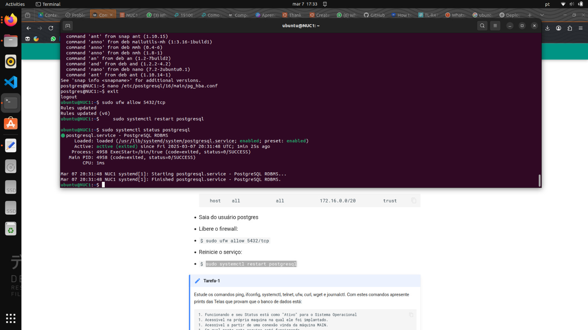
2. Acessivel na própria maquina na qual ele foi implantado.
Para verificar que esta acessivel na própria maquina na qual ele foi implantado foi utilizado o comando:
``` bash
psql -U cloud -d tasks -h localhost
```
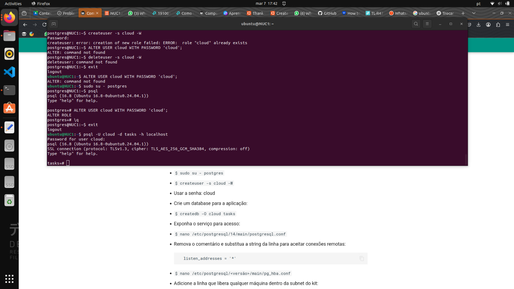
3. Acessivel a partir de uma conexão vinda da máquina MAIN.
E para verificar que esta acessivel a partir de uma conexão vinda da máquina MAIN:
``` bash
telnet [IP do server1] 5432
```


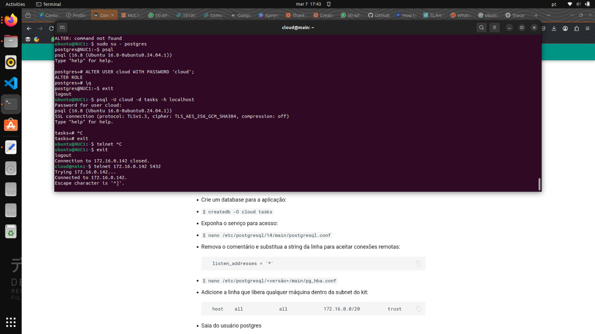
4. Em qual porta este serviço está funcionando.

Finalmente verificamos em qual porta o PostgreSQL está rodando com:
``` bash
sudo ss -tulnp | grep postgres
```

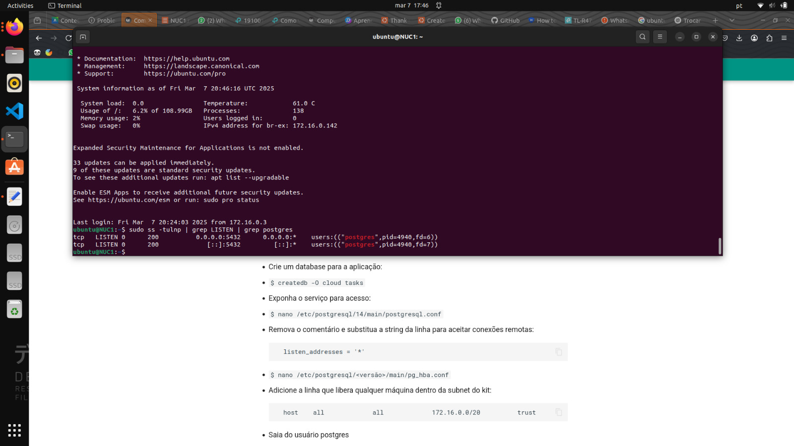

---

### Parte 2: Implementação Manual da Aplicação Django e Banco de Dados

**Configuração do MaaS**

Para iniciar, acessei o MaaS e fiz login utilizando o CLI com o seguinte comando:

```sh
maas login [meu_usuario] http://172.16.0.3:5240/MAAS/
```

Em seguida, obtive o token no dashboard dentro das configurações do usuário. Com o token em mãos, solicitei a reserva de uma máquina no MaaS:

```sh
maas [meu_usuario] machines allocate name=server2
```

A resposta retornou um JSON contendo várias informações, entre elas o `system_id`, que anotei para uso posterior.

**Deploy da Máquina e Instalação da Aplicação**

Com o `system_id`, iniciei o deploy da máquina via CLI:

```sh
maas [meu_usuario] machine deploy [system_id]
```

Assim que o deploy foi concluído, acessei a máquina `server2` via SSH e clonei o repositório do projeto Django:

```sh
git clone https://github.com/raulikeda/tasks.git
```

Naveguei até o diretório `tasks` e executei o script de instalação:

```sh
cd tasks
./install.sh
```

Após a instalação, reiniciei a máquina e aguardei o processo de inicialização.

**Teste do Serviço**


Como server1 não estava registrado no DNS, adicionei-o manualmente ao arquivo `/etc/hosts` do **server2**:
Apos a máquina reiniciar adicionei manualmente o IP no `/etc/hosts`

```bash
[IP_DO_SERVER1]  server1
```

Esta configuração permite que o **server2** resolva o nome `server1` para o endereço IP `192.168.1.100`, mesmo sem uma entrada correspondente no servidor DNS.

!!! note
    Esta alteração é local apenas para **server2** e não afeta outros sistemas na rede.

Para validar que a aplicação estava rodando corretamente, realizei um teste de acesso ao serviço na porta 8080 diretamente do terminal do MaaS:

```sh
wget http://[IP_server2]:8080/admin/
```

Se o acesso fosse bem-sucedido, a interface de administração do Django estaria funcionando corretamente.

**Exposição do Serviço via Túnel SSH**

Para acessar a aplicação no navegador sem precisar configurar NAT no roteador, utilizei um túnel SSH. Primeiro, desconectei do SSH do MaaS e reconectei utilizando o seguinte comando:

```sh
ssh cloud@10.103.0.X -L 8001:[IP_server2]:8080
```

Esse comando criou um túnel, redirecionando o serviço rodando na porta 8080 do `server2` para a porta 8001 no meu localhost. Certifiquei-me de que a porta 8001 não estava em uso antes de rodar o comando.

Então, acessei o Django Admin pelo navegador no seguinte endereço:

```
http://localhost:8001/admin/
```

Fiz login com as credenciais padrão:

- **Usuário:** cloud
- **Senha:** cloud


**Tarefa 2**

1.Dashboard do **MAAS** com as máquinas.

2. Da aba images, com as imagens sincronizadas.
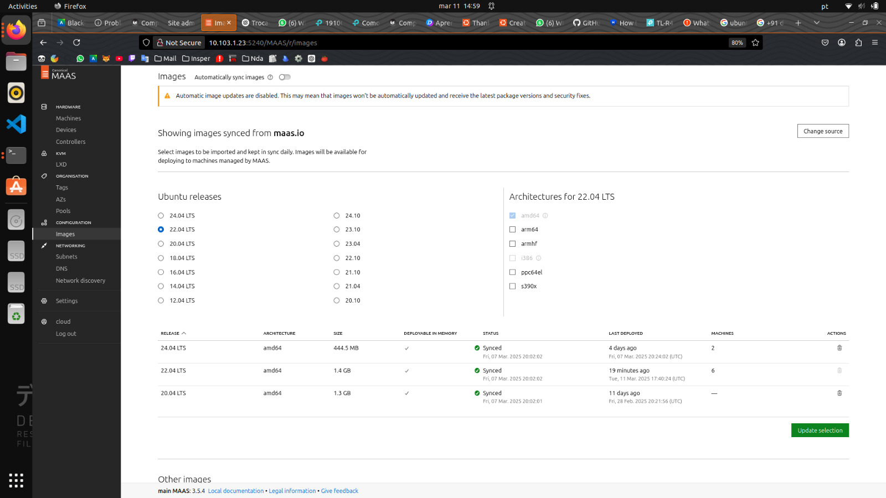
3. Aba de cada maquina(5x) mostrando os testes de hardware e commissioning com Status "OK"
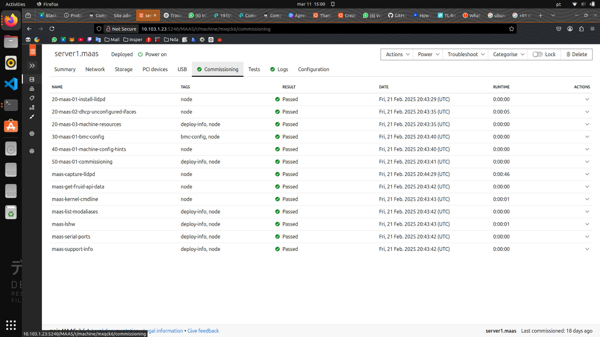

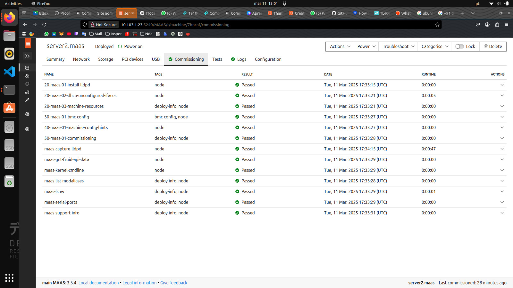
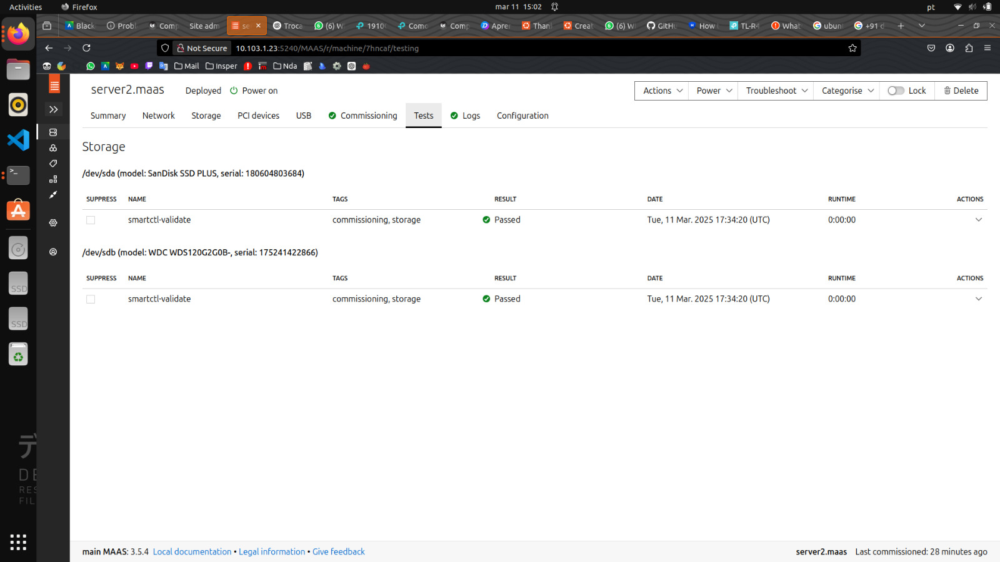

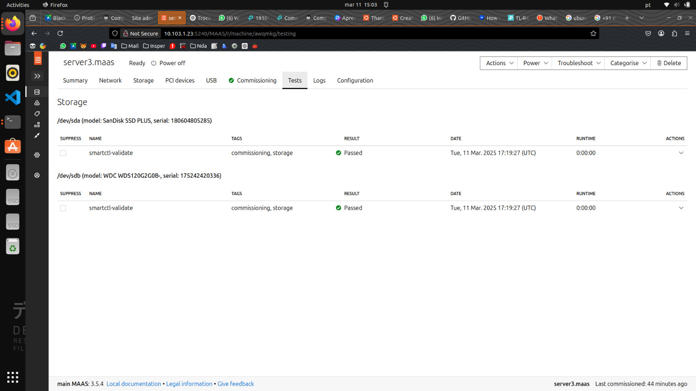


### Parte 3: Status dos servidores

**Tarefa-3**


**Prints Comprovando a Configuração**

- Capturamos um print da tela do Dashboard do MAAS, mostrando as duas máquinas configuradas com seus respectivos IPs.

- Registramos também um print da aplicação Django em execução, comprovando a conexão com o servidor.
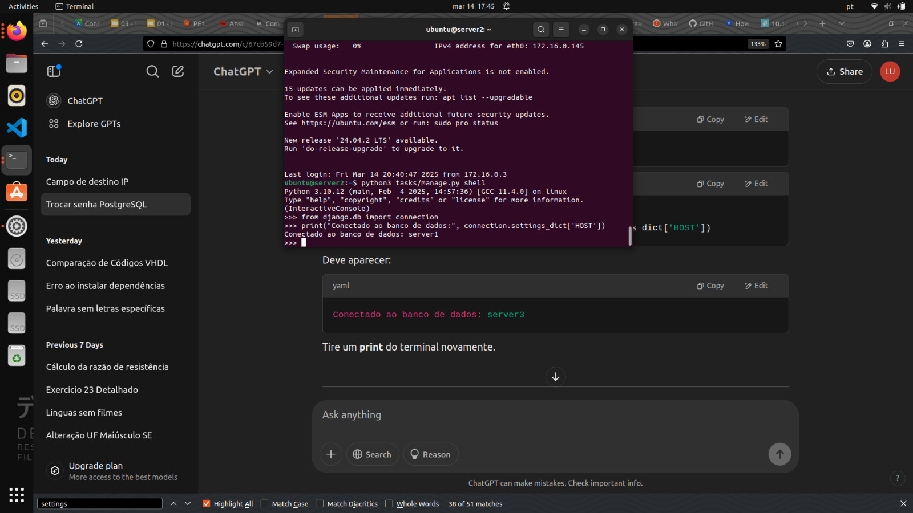
1. Explique como foi feita a implementacao manual da aplicacao Django e banco de dados.

**Implementação Manual da Aplicação Django e Banco de Dados**

Inicialmente, configuramos uma única aplicação Django. No entanto, percebemos a necessidade de expandir para dois servidores de aplicação (server2 e server3), ambos conectados a um único banco de dados hospedado no server1. Essa estratégia foi adotada por dois motivos principais:

1. **Alta Disponibilidade**: Caso um dos nós falhe, o outro continua operacional, garantindo acesso contínuo aos usuários.
2. **Balanceamento de Carga**: Distribuímos as requisições entre os servidores, melhorando a escalabilidade e o desempenho da aplicação.

Para otimizar esse processo, decidimos automatizar a instalação e configuração usando o Ansible. Essa ferramenta facilitou a replicação do ambiente em múltiplos servidores, garantindo consistência e reduzindo erros manuais.

### Parte 4: Utilizando o Ansible - Deploy Automatizado de Aplicação 

**Configuração do Server3 e Deploy com Ansible**

Após  para o maas via cli, igual feito anteriormente para o server2, realizamos a instalação e configuração do Ansible no servidor principal (main). Utilizamos o seguinte procedimento:

1. Instalamos o Ansible:
   ```sh
   sudo apt install ansible
   ```
2. Baixamos o playbook de instalação da aplicação Django:
   ```sh
   wget https://raw.githubusercontent.com/raulikeda/tasks/master/tasks-install-playbook.yaml
   ```
3. Executamos o playbook para provisionar o server3 automaticamente:
   ```sh
   ansible-playbook tasks-install-playbook.yaml --extra-vars server=[IP server3]
   ```

O Ansible garantiu que todos os procedimentos fossem executados de forma idempotente, ou seja, podíamos repetir o processo sem impactar negativamente o ambiente. Além disso, possibilitou a configuração simultânea de múltiplos servidores, facilitando a expansão da infraestrutura.


**Tarefa 4**

1. Tela do Dashboard do MAAS com as 3 Maquinas e seus respectivos IPs.
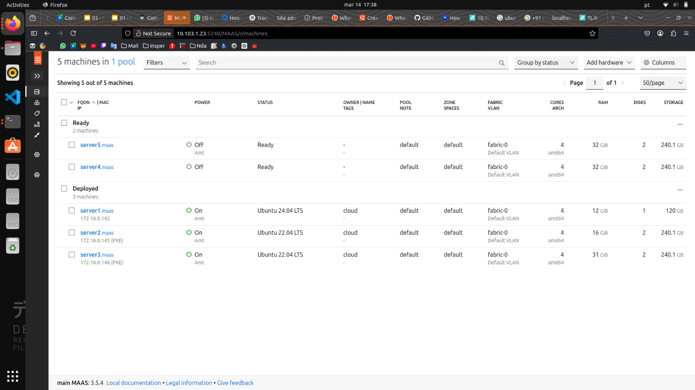
1. Aplicacao Django, provando que voce está conectado ao server2 
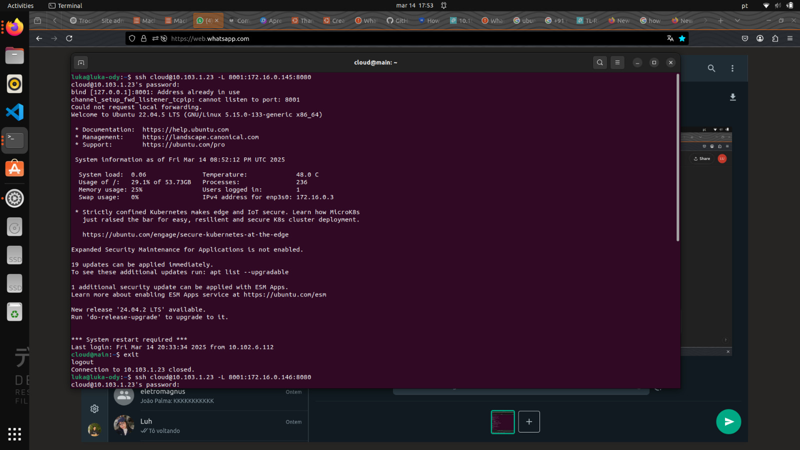
1. Aplicacao Django, provando que voce está conectado ao server3
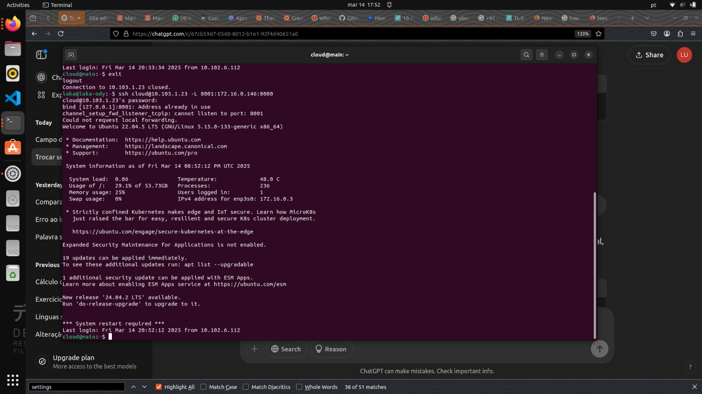 
1. Diferenca entre instalar manualmente a aplicacao Django e utilizando o Ansible.


Com essa abordagem, conseguimos implementar uma solução escalável e confiável para nossa aplicação Django. A automação proporcionada pelo Ansible simplificou o gerenciamento dos servidores e garantiu que a aplicação estivesse sempre disponível e distribuída adequadamente.

### Parte 4: Balanceamento de Carga com NGINX

**Nossa Implementação com NGINX**

Instalação do NGINX

Primeiramentea foi feito o deploy e instalação do NGINX no servidor `server4` para atuar como nosso balanceador de carga:

```bash
sudo apt update
sudo apt install nginx -y

```

**Configuração do Módulo Upstream**

Para configurar o balanceamento round robin, utilizamos o módulo upstream do NGINX. Editamos o arquivo de configuração do site padrão:

```bash
sudo nano /etc/nginx/sites-available/default
```

Adicionamos a configuração do balanceamento de carga da seguinte forma:

```nginx
upstream backend {
    server [IP_DO_SERVER2] :8080;
    server [IP_DO_SERVER3] :8080;
}


server {
    location / {
        proxy_pass http://backend;
    }
}
```

Após salvar as alterações, reiniciamos o serviço do NGINX:

```bash
sudo service nginx restart
```
**Tarefa 5**

1. De um print da tela do Dashboard do MAAS com as 4 Maquinas e seus respectivos IPs.
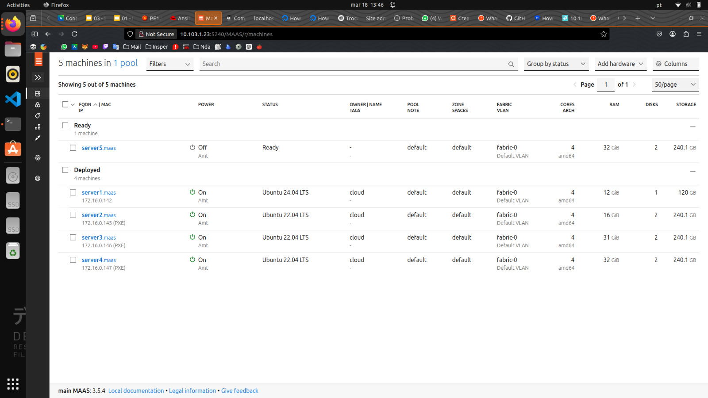
**Personalização das Aplicações Django**

1. Alteramos o conteúdo da mensagem contida na função `index` do arquivo `tasks/views.py` de cada server para distinguir ambos os servers. 

Para podermos identificar facilmente qual servidor estava respondendo a cada requisição, modificamos o arquivo `tasks/views.py` em cada instância Django, alterando a mensagem de resposta para algo único em cada servidor:

```python
# Em server1
from django.shortcuts import render
from django.http import HttpResponse

def index(request):
    return HttpResponse("Hello, world. You're at server 2.")
```


```python
# Em server2
from django.shortcuts import render
from django.http import HttpResponse

def index(request):
    return HttpResponse("Hello, world. You're at server 2.")
```
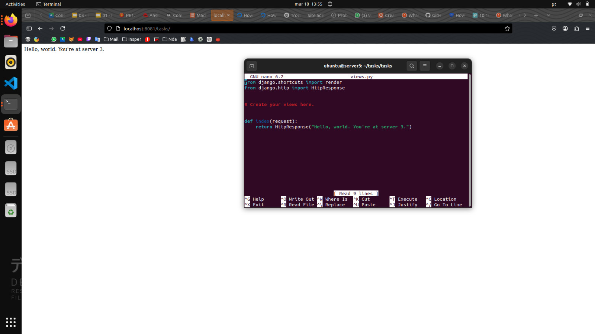

3. Faça um `GET request` para o path que voce criou em urls.py para o Nginx e tire 2 prints das respostas de cada request, provando que voce está conectado ao server 4, que é o Proxy Reverso e que ele bate cada vez em um server diferente server2 e server3.

3. As respostas de cada request do server 4, mostram que cada vez que um `GET request` é feito
ele bate cada vez em um server diferente server2 e server3.
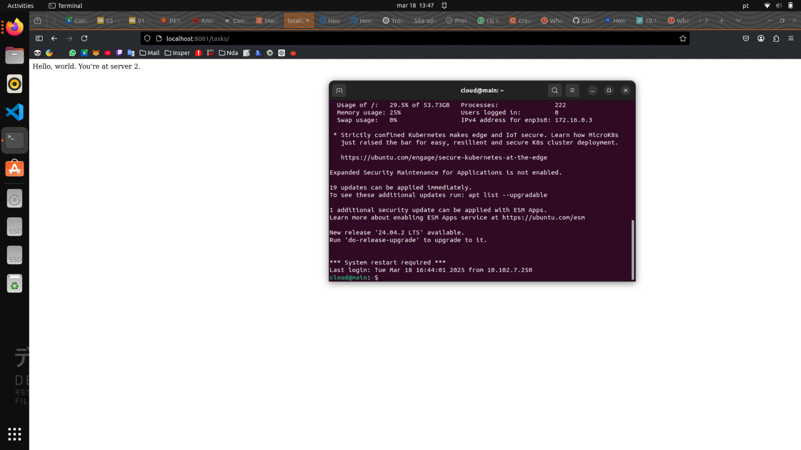
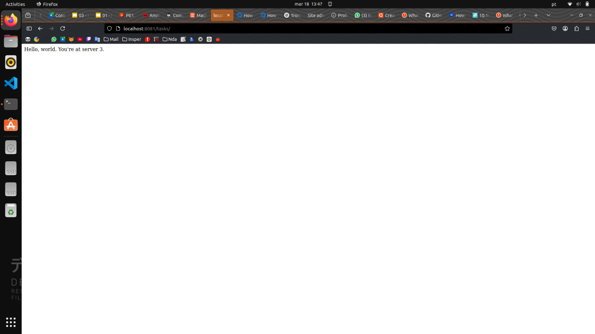


