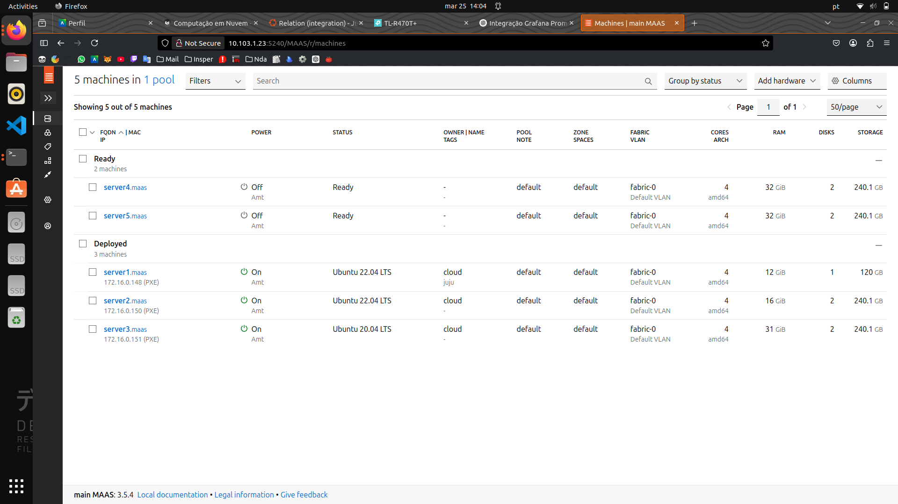
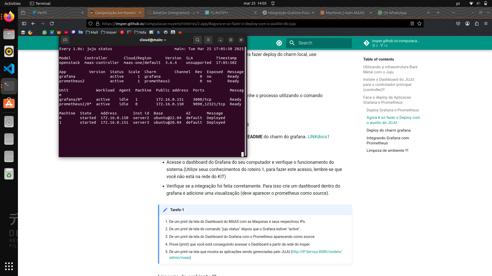
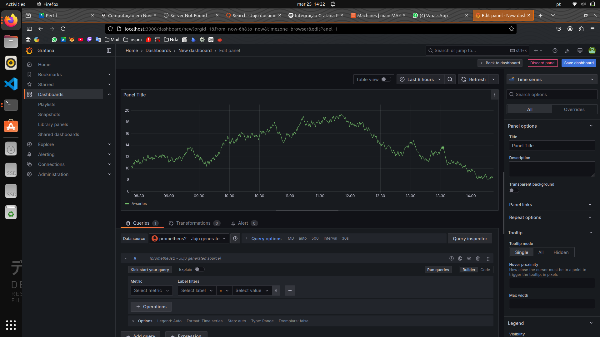
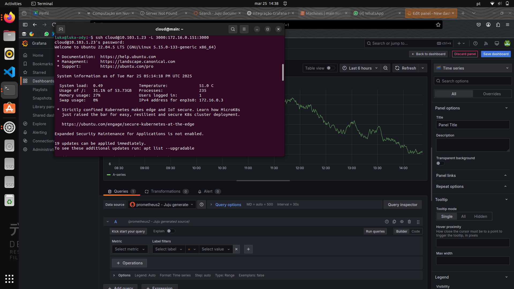
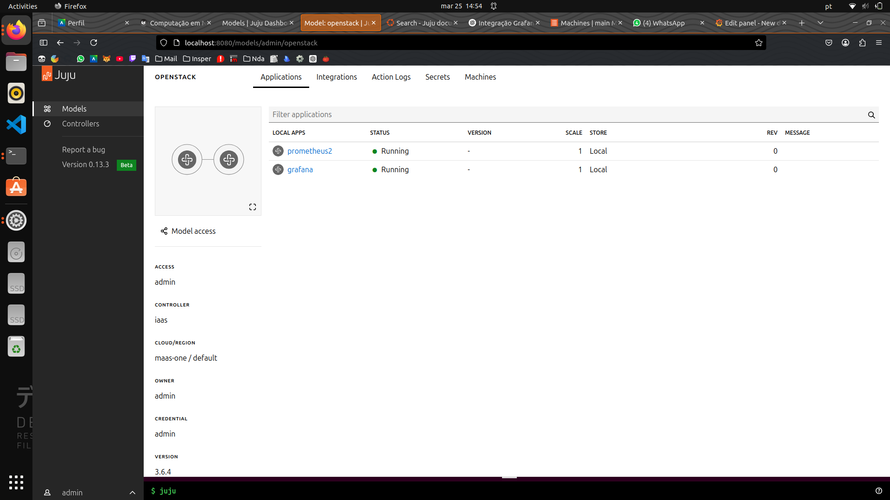

# Relatório - Roteiro 2: Gerenciamento de Aplicações com Juju

## Objetivo
O objetivo deste roteiro é explorar o orquestrador Juju para gerenciar aplicações em ambientes de nuvem. Através do Juju, buscamos:

1. Simplificar o deploy e gerenciamento de aplicações complexas  
2. Implementar soluções de monitoramento com Prometheus e Grafana  
3. Gerenciar relacionamentos entre serviços de forma declarativa  
4. Automatizar a configuração de ambientes escaláveis  

---

## Infra

### Configuração Inicial do Ambiente Juju

1. **Instalação do Juju**:
```bash
sudo snap install juju --channel 3.6
```
Depois, verificamos que o Juju reconhece o MaaS como provedor de recursos com:
```bash
juju clouds
```

Como o MaaS não apareceu na lista de clouds do Juju, adicionamos o manualmente usando um arquivo YAML.

```bash
nano maas-cloud.yaml
```
```yaml
clouds:
  my-maas:
    type: maas
    auth-types: [oauth1]
    endpoint: http://<SEU_IP_MAAS>:5240/MAAS
```
```bash
juju add-cloud --client my-maas maas-cloud.yaml
```

Adicionamos as credenciais MAAS para que o Juju possa interagir com a nova cloud adicionada.
```yaml
credentials:
  maas-one:
    anyuser:
      auth-type: oauth1
      maas-oauth: <API KEY>

```
```bash
juju add-credential --client -f maas-creds.yaml maas-one
```

### Criação do Controlador

Para criar o controlador no `server1`, primeiro colocamos a tag "juju" na máquina pelo painel do MAAS. Depois, executamos:

```bash
juju bootstrap --bootstrap-series=jammy --constraints tags=juju maas-one maas-controller

```

Esse processo pode demorar, pois o Juju precisa provisionar uma máquina, instalar pacotes e configurar serviços. Para acompanhar o progresso, utilizamos e deixaremos esse terminal aberto daqui em diante:

```bash
watch -n 1 --color 'juju status --color'
```

## App

```bash
juju add-model --config default-series=jammy openstack
juju switch controller
juju deploy juju-dashboard --to lxd:0
juju intergrate juju-dashboard controller
```


```bash
juju enable-dashboard
juju dashboard
```

```bash
mkdir -p /home/cloud/charms
cd /home/cloud/charms
```
e dentro da pasta charms

```bash
juju download grafana
juju download prometheus2
```

```bash
juju switch openstack
juju deploy ./prometheus2_r60.charm
juju deploy grafana

```
depois devemos intergrar eles
```bash
juju intergrate grafana:grafana-source prometheus2:grafana-source
```

```bash
juju expose grafana
juju expose prometheus2
```

Acessamos o Grafana via navegador:

Obtemos o IP da máquina do grafana com juju status

Acessamos http://<IP>:3000 e fizemos login com a senha resultante dessa linha

```bash
juju run grafana/0 get-admin-password
```

##Tarefas





