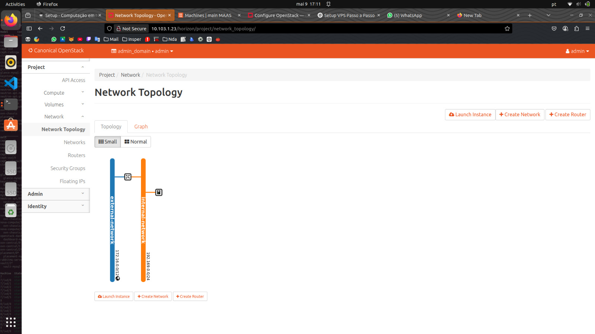
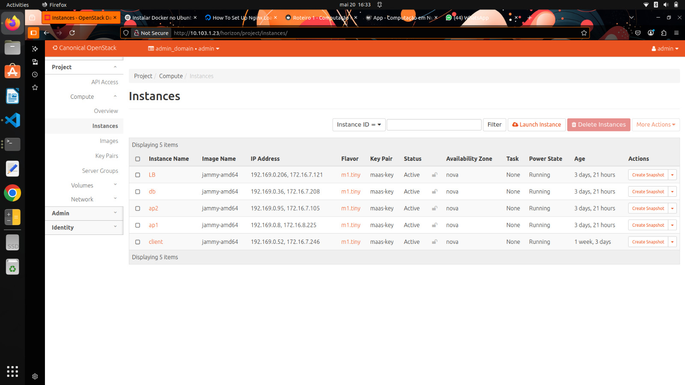

# Roteiro 3 - OpenStack

## Objetivo

Este roteiro tem como objetivo configurar e utilizar o ambiente OpenStack para integração com Docker e Kubernetes, possibilitando gerenciamento eficiente de contêineres e garantindo escalabilidade e alta disponibilidade dos serviços.

## Tarefa 1

### Status JUJU
O JUJU foi utilizado para gerenciar as máquinas físicas e virtuais. A imagem abaixo apresenta o status das aplicações e serviços gerenciados pelo JUJU.

### Dashboard do MAAS com máquinas
O MAAS (Metal as a Service) mostra as máquinas físicas e seu status, indicando quais estão disponíveis para utilização.

### Aba Compute Overview no OpenStack
Nesta aba temos uma visão geral do ambiente computacional do OpenStack, incluindo recursos utilizados e disponíveis.

### Aba Compute Instances no OpenStack
Aqui são apresentadas as instâncias virtuais ativas no ambiente, incluindo detalhes sobre recursos alocados e status.

### Aba Network Topology no OpenStack
Esta aba ilustra a topologia da rede criada no OpenStack, evidenciando conexões, redes e instâncias.

## Tarefa 2

### Dashboard do MAAS com as máquinas
Após modificações, o MAAS mostra as máquinas físicas com ajustes nas alocações.

### Aba Compute Overview no OpenStack
Esta aba atualizada do OpenStack permite observar alterações no uso de recursos computacionais.

### Aba Compute Instances no OpenStack
A aba mostra novas instâncias ou alterações em instâncias anteriores.

### Aba Network Topology no OpenStack
A nova topologia de rede reflete alterações feitas no ambiente.

**Diferenças observadas entre Tarefa 1 e Tarefa 2:**
- Foram identificadas diferenças principalmente na configuração das instâncias, utilização de recursos e possíveis alterações na rede após configuração adicional.

**Recursos criados e modificados:**
- Instâncias virtuais, recursos computacionais e ajustes na topologia de rede para suportar maior carga ou diferentes requisitos.

## Tarefa 3

### Arquitetura de rede com sub-redes

A imagem a seguir representa toda a arquitetura de rede configurada, desde o acesso do usuário no Insper até a instância final alocada no OpenStack. Ela mostra claramente a transição entre redes (Rede Insper, VPN, Internet), a entrada pelo roteador do OpenStack e a separação entre rede externa e interna. Nessa rede interna, temos todas as VMs alocadas, como Load Balancer, instâncias de aplicação, banco de dados e cliente. As sub-redes utilizadas também estão indicadas explicitamente para melhor entendimento da estrutura lógica.

## Tarefa 4

### Relatório dos passos utilizados

Nesta tarefa foram executados os seguintes passos detalhados:

1. Instalação e configuração inicial do OpenStack, incluindo Octavia para balanceamento de carga.
2. Criação da arquitetura de rede necessária para o ambiente.
3. Definição e configuração de instâncias virtuais (VMs) com nomes e IPs específicos.
4. Implementação de uma aplicação FastAPI conectada através de Nginx/LoadBalancer.
5. Alocação e gerenciamento das instâncias em máquinas físicas diferentes via OpenStack.

### Arquitetura de rede
Abaixo a imagem detalha a arquitetura de rede configurada no ambiente OpenStack, evidenciando conexões entre serviços, redes e instâncias.

### Lista de VMs com nomes e IPs alocados
Nesta imagem é possível verificar todas as VMs configuradas, incluindo seus respectivos nomes e IPs.

### Dashboard do FastAPI conectado via máquina Nginx/LB
O dashboard do serviço FastAPI mostra sua disponibilidade através da interface configurada pelo Nginx Load Balancer.

### Instâncias e suas alocações nos servidores (máquinas físicas)
As imagens seguintes ilustram em quais máquinas físicas cada instância virtual foi alocada:

1. 
2. 
3. 
4. 