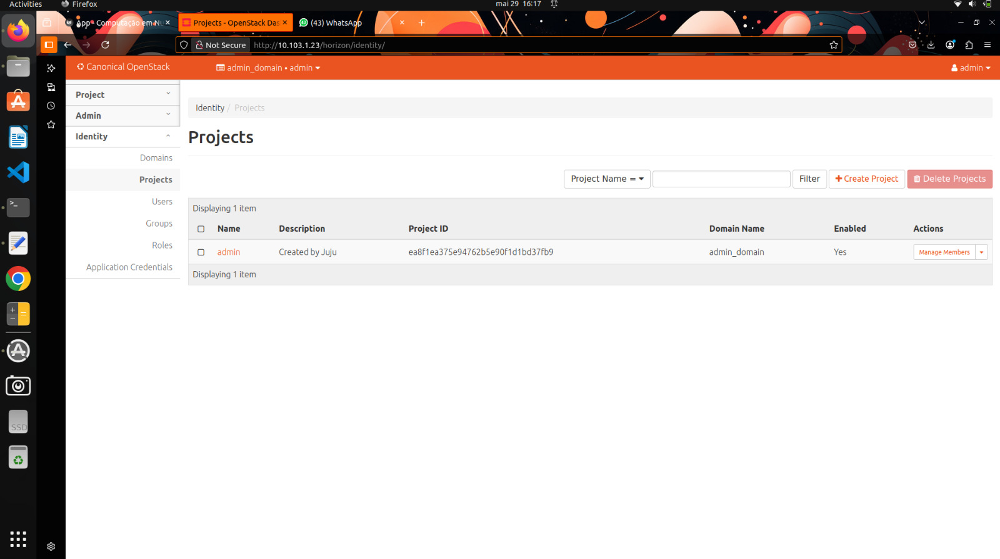
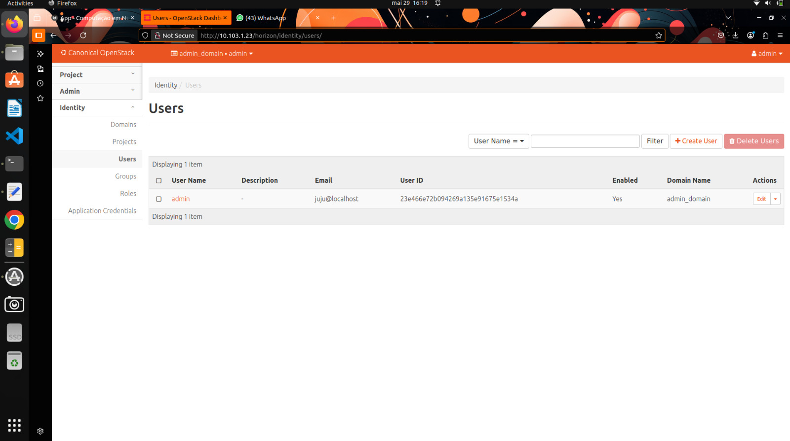
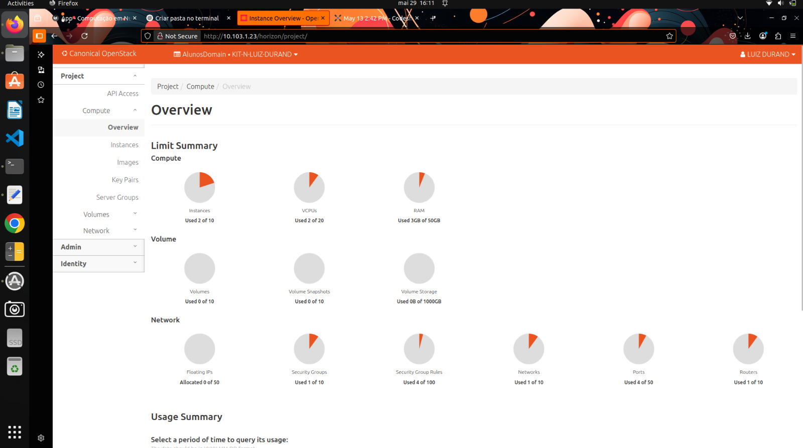
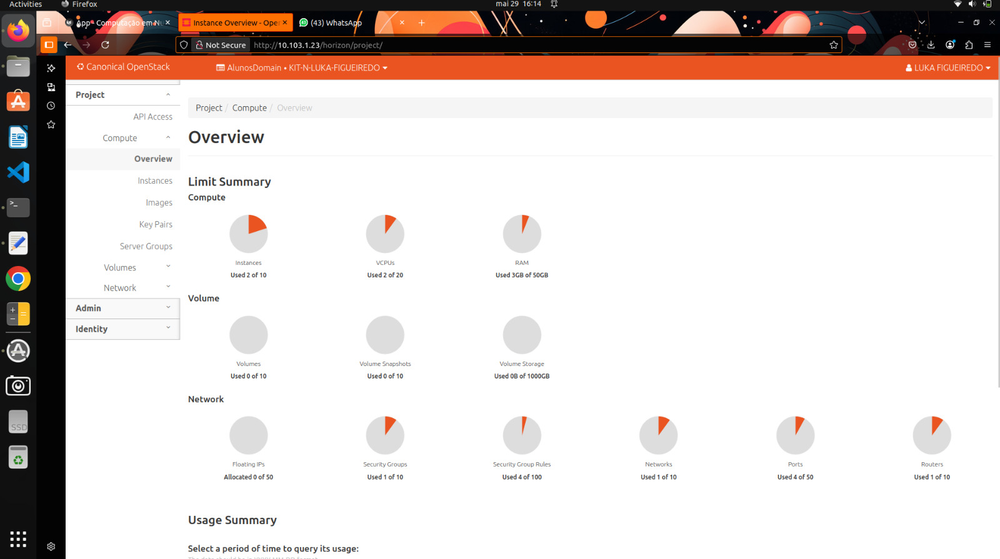
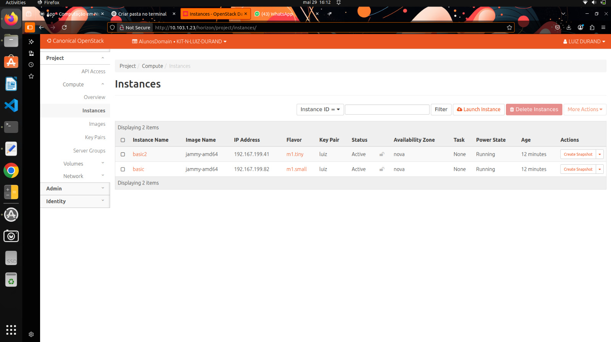
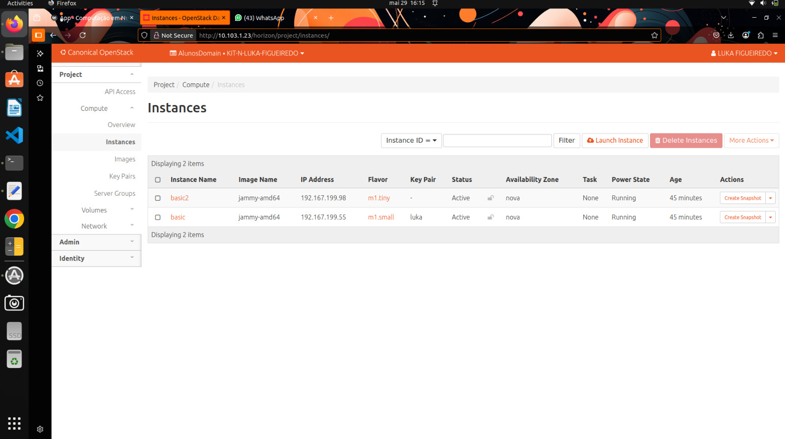
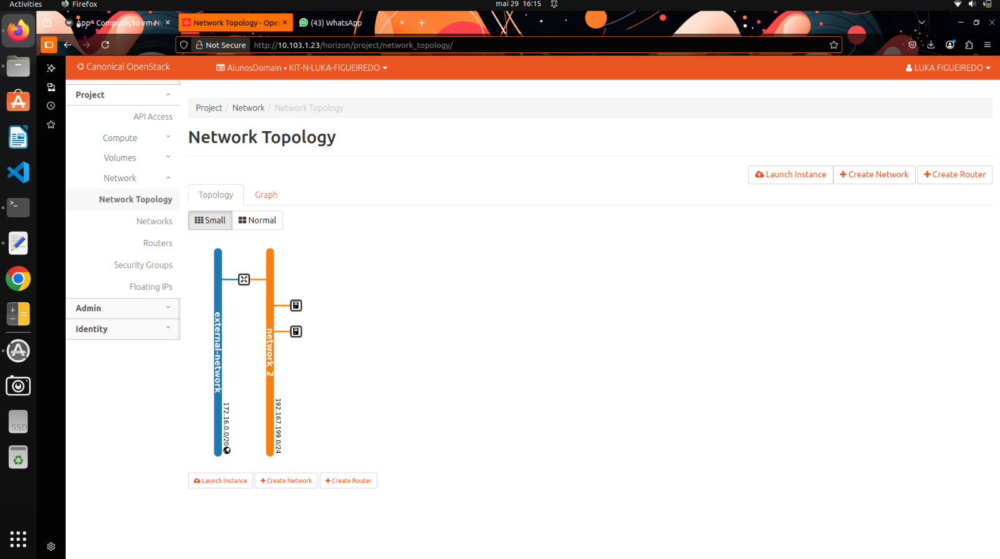

# Roteiro 4 - OpenStack e Kubernetes: Checkpoint por Aluno

## Introdução

Neste roteiro, avançamos na consolidação do domínio do OpenStack por meio de um checkpoint individual. A proposta é garantir que cada aluno seja capaz de navegar pelas diferentes abas da plataforma, compreendendo a lógica de projetos, usuários, alocação de instâncias, além de analisar a topologia de rede resultante da sua configuração.

A verificação parte de um conjunto mínimo de prints que comprovam o uso adequado da interface de gerenciamento e a correta associação de recursos.

## Tarefa 1 a 6 - Verificações no Painel OpenStack

Abaixo estão os prints que comprovam o estado atual da minha infraestrutura dentro do OpenStack, conforme solicitado:

### Identity - Aba "Projects"
Exibe os projetos associados ao ambiente OpenStack. Cada projeto agrupa recursos e usuários, permitindo o isolamento de ambientes.

### Identity - Aba "Users"
Mostra os usuários cadastrados, suas funções e permissões dentro dos projetos. Cada usuário tem papéis distintos e pode interagir com recursos conforme suas permissões.

### Compute - Aba "Overview"
Painel de visão geral com consumo de recursos, como instâncias, vCPUs, RAM e armazenamento. Útil para controle de capacidade.

### Compute - Aba "Instances"
Lista detalhada de instâncias ativas, incluindo nome, status, IP e recursos alocados.

### Network - Aba "Topology" (Visão 1)
Apresenta visualmente a topologia de rede criada, com destaque para sub-redes, roteadores e instâncias conectadas.

### Network - Aba "Topology" (Visão 2)
Outra visão complementar da mesma topologia, demonstrando a comunicação entre componentes virtuais.

### Topologia Detalhada da Aplicação
Visualização da arquitetura montada com Kubernetes e serviços integrados, incluindo Load Balancer, banco de dados, APIs e cliente.

## Terraform: Automação da Infraestrutura como Código

Neste roteiro, foi fundamental a utilização do Terraform como ferramenta de Infraestrutura como Código (IaC) para provisionar e gerenciar os recursos no OpenStack de forma automatizada e reprodutível. O Terraform permite definir a infraestrutura desejada por meio de arquivos de configuração (`.tf`), garantindo consistência e versionamento das alterações.

**Etapas realizadas:**

1. **Definição da infraestrutura:** Foram criados arquivos `.tf` especificando redes, sub-redes, roteadores e instâncias, adaptados às necessidades de cada aluno.

2. **Inicialização do Terraform:** Com o comando `terraform init`, o ambiente foi preparado, baixando os plugins necessários para o provedor OpenStack.

3. **Planejamento das alterações:** Utilizando `terraform plan`, foi possível visualizar as ações que o Terraform executaria, permitindo uma revisão antes da aplicação.

4. **Aplicação das configurações:** Por fim, `terraform apply` foi executado para criar ou atualizar os recursos conforme definido nos arquivos de configuração.

Essa abordagem proporcionou uma gestão eficiente da infraestrutura, facilitando a replicação do ambiente e minimizando erros manuais. Além disso, o uso do Terraform alinhou-se às práticas modernas de DevOps, promovendo agilidade e controle no gerenciamento dos recursos em nuvem.

## Plano de Disaster Recovery e SLA

Diante da responsabilidade de liderar a implantação de um sistema crítico, distribuído em várias regiões do Brasil e com alto grau de confidencialidade, a escolha da infraestrutura se dá pela adoção de uma **nuvem privada (Private Cloud)**. Isso garante controle direto sobre os dados sensíveis, menor exposição pública e permite customizações específicas de segurança e rede.

Para sustentar a operação contínua e minimizar falhas, a presença de um **time DevOps** é essencial. Ele garante a automação de processos, integração contínua, entrega ágil de melhorias e respostas rápidas a incidentes. O time atua de forma colaborativa entre desenvolvimento e operações, otimizando o ciclo de vida das aplicações.

Pensando em resiliência e continuidade, elaboramos um plano de Disaster Recovery (DR) e Alta Disponibilidade (HA) que prevê os seguintes pilares:

- **Mapeamento de ameaças**: Foram identificadas ameaças como falhas de hardware, erros humanos, ataques cibernéticos (DDoS, ransomware), indisponibilidade de links de rede e falhas de energia nos datacenters. A análise permitiu priorizar os riscos de maior impacto e frequência.

- **Plano de recuperação**: A estratégia prevê snapshots automáticos e regulares das VMs e volumes críticos, failover automatizado entre instâncias replicadas, e reimplantações rápidas via scripts de infraestrutura como código (IaC). Também são utilizados testes periódicos de recuperação para garantir a eficácia dos procedimentos.

- **Política de backup**: A equipe estabelece backups diários incrementais e semanais completos, com retenção de no mínimo 30 dias. Os dados são replicados em zonas de disponibilidade diferentes, com verificação automatizada da integridade.

- **Alta disponibilidade**: Load Balancers e instâncias em clusters replicados garantem balanceamento de carga e tolerância a falhas. O uso de Kubernetes permite a redistribuição automática de pods em caso de falhas físicas, enquanto serviços críticos são monitorados por probes de saúde.

Este plano garante que a infraestrutura possa resistir a incidentes, restaurar operações em minutos e cumprir os SLAs estabelecidos com segurança e robustez.

## Conclusão

Este checkpoint reforça a importância do domínio individual da plataforma OpenStack, especialmente na gestão de usuários, projetos e instâncias. Os prints apresentados atestam a execução correta das tarefas propostas, bem como a configuração funcional da infraestrutura de rede. O domínio dessas operações básicas garante uma base sólida para a implantação e manutenção de soluções em nuvem mais complexas.